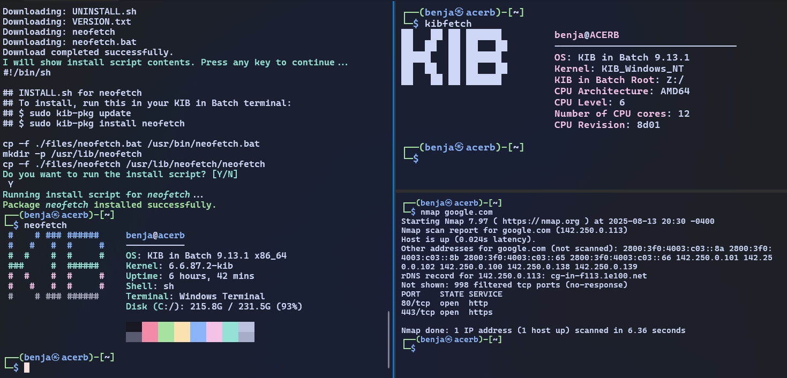

# Kali in Batch

Kali in Batch is a batch script-based environment that runs a bash shell with many Kali Linux utilities.

## Installation

* Download a source code archive from the [latest release](https://github.com/Kali-in-Batch/kali-in-batch/releases/latest).
* Run `setup.bat` to download and set up required binaries and dependencies.
* After setup, run `kali_in_batch.bat` to start the Kali in Batch environment.
* During the first run, you will be prompted to assign a drive letter to the root filesystem (e.g., Z:). This drive letter will be used to mount the Kali root filesystem.
* The installer will check for required dependencies such as Nmap, Neovim, and Whois, and install them automatically using winget if they are missing.

## Features

* Bash environment with a Kali Linux style shell prompt.
* Comes with Kali Linux utilities you would expect, including:
  * Netcat
  * Nmap
  * Whois
  * Usable shell scripting environment.
* Simple package manager accessible via the `pkg` command.
* Automatic dependency management using winget.
* Update checking mechanism that compares local and remote versions to notify if the installation is outdated.
* Custom shell prompt and aliases for common commands to enhance usability.

## Usage

1. Run `setup.bat` to download required binaries.
2. Run `kali_in_batch.bat` to launch the Kali in Batch shell.
3. On first run, follow the prompts to assign a drive letter and complete setup.
4. Login with your username or root when prompted.
5. Once setup is complete, enjoy the bash shell with Kali Linux utilities.

## Preview

## License

This project is licensed under the GPL-2.0-only License. See the [LICENSE](LICENSE) file for details.

## Links

* [GitHub Repository](https://github.com/Kali-in-Batch/kali-in-batch)
* [Latest Releases](https://github.com/Kali-in-Batch/kali-in-batch/releases/latest)

---

This project is not associated with Kali Linux.
