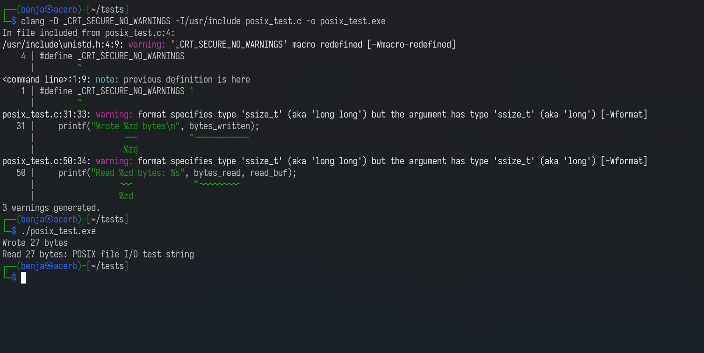

# Kali in Batch

Kali in Batch is a batch script-based environment that runs a bash shell with many Kali Linux utilities.

## Installation

* Download a source code archive from the [latest release](https://github.com/Kali-in-Batch/kali-in-batch/releases/latest).
* Run `setup.bat` to download and set up required binaries and dependencies.
* After setup, run `kali_in_batch.bat` to start the Kali in Batch environment.

## Features

* Bash environment with a Kali Linux style shell prompt
* Comes with Kali Linux utilities you would expect, which are the following:
  * Netcat
  * Nmap
  * Whois
  * Usable shell scripting environment
* Has a simple package manager, which has packages like [neofetch](https://github.com/dylanaraps/neofetch)
  * You may invoke this package manager by running the `pkg` command.

## Usage

1. Run `setup.bat` to install and configure the environment.
2. Run `src\kali_in_batch.bat` to launch the Kali in Batch shell.
3. During the first run, follow the prompts to assign a drive letter and complete setup.
4. Use the preinstall shell commands:
   * `help` - Display available commands.
   * `done` - Finish setup and boot into Kali in Batch.
   * `wipe` - Wipe the Kali root filesystem.
   * `add-kibenv` - Add the `.kibenv` file.
   * `add-bashrc` - Add the default `.bashrc` file.
   * `edit-bashrc` - Edit the `.bashrc` file.
5. Once setup is complete, you can now enjoy the bash shell.

## Preview

## License

This project is licensed under the Apache-2.0 License. See the [LICENSE](LICENSE) file for details.

## Links

* [GitHub Repository](https://github.com/Kali-in-Batch/kali-in-batch)
* [Latest Releases](https://github.com/Kali-in-Batch/kali-in-batch/releases/latest)

---

This project is not associated with Kali Linux.
